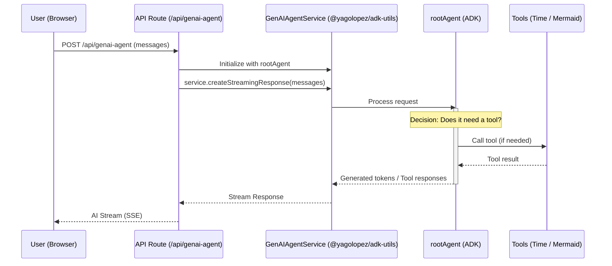

# ADK Utils Example

A modern, high-performance chat application demonstrating the integration of **Google Agent Development Kit (ADK)** with **Next.js 16**, **AI SDK**, and custom utilities.

Includes an `llms.txt` file for enhanced discoverability and documentation for AI-assisted development.

## 🚀 Features

- **Advanced AI Agents**: Built with `@google/adk`, featuring custom tools and multi-model support.
- **Enhanced Model Support**: Utilizes [`@yagolopez/adk-utils`](https://www.npmjs.com/package/@yagolopez/adk-utils) to provide seamless integration with **Ollama** models within the ADK ecosystem. 
  - *Usage*: See `app/agents/agent1.ts` where it's used to instantiate the `OllamaModel` for local LLM execution.
- **Modern Chat UI**: A responsive, premium chat interface with:
  - Streaming responses.
  - Markdown rendering (syntax highlighting, tables, etc.).
  - **Mermaid.js** diagrams support for visual representations.
  - Interactive suggestions and empty state.
- **Smart Components**:
  - **Rate Limiting**: Integrated using `@tanstack/react-pacer` to protect resources.
  - **Auto-scroll**: Efficient message list scrolling.
  - **Typing Indicators**: Real-time feedback during AI generation.
- **Tool Integration**:
  - `get_current_time`: Retrieves time for any city worldwide.
  - `create_mermaid_diagram`: Generates visual flowcharts, sequence diagrams, and more.
- **Optimized for DX**: 
  - Tailwind CSS 4 for state-of-the-art styling.
  - ESLint and Prettier for code consistency.
  - Jest for unit testing.

## 🛠️ Tech Stack

- **Framework**: [Next.js 16](https://nextjs.org/) (App Router, React 19)
- **AI Core**: 
  - [@google/adk](https://github.com/google/adk)
  - [AI SDK (Vercel)](https://sdk.vercel.ai/)
  - [@yagolopez/adk-utils](https://www.npmjs.com/package/@yagolopez/adk-utils)
- **Styling**: [Tailwind CSS 4](https://tailwindcss.com/)
- **State Management**: React Hooks + TanStack Pacer
- **Icons**: [Lucide React](https://lucide.dev/)
- **Formatting/Diagrams**: [Streamdown](https://github.com/streamdown/streamdown)

## 🚦 Getting Started

### Prerequisites

- Node.js 18+ 
- npm / pnpm / yarn

### Installation

1. Clone the repository:
   ```bash
   git clone https://github.com/YagoLopez/adk-utils-example.git
   cd adk-utils-example
   ```

2. Install dependencies:
   ```bash
   npm install
   ```

3. Set up environment variables:
   Create a `.env` file in the root and add your configuration (e.g., API keys for Gemini or Ollama endpoints).

### Running the App

- **Development Server**:
  ```bash
  npm run dev
  ```
  Open [http://localhost:3000](http://localhost:3000) to start chatting.

- **ADK Web Tool**:
  Launch the ADK web explorer to inspect your agents:
  ```bash
  npm run adk:web
  ```

## 🌊 Request Flow

The following diagram illustrates how a user message is processed through the system:



## 📂 Project Structure

- `/app`: Next.js app router pages and API routes.
  - `/app/agents`: Definition of ADK agents and tools.
  - `/app/api/genai-agent`: Backend route for agent communication.
- `/components`: Reusable UI components (ChatHeader, ChatInput, ChatMessage, etc.).
- `/hooks`: Custom React hooks (e.g., `useScrollToBottom`).
- `/lib`: Shared utility functions.

## 🧪 Testing

Run unit tests with Jest:
```bash
npm test
```

## 📝 Roadmap/Todo

- [ ] Support for agent/model selection from the UI.
- [ ] Automatic tool response detection in the UI.

## 📄 License

This project is licensed under the MIT License.
